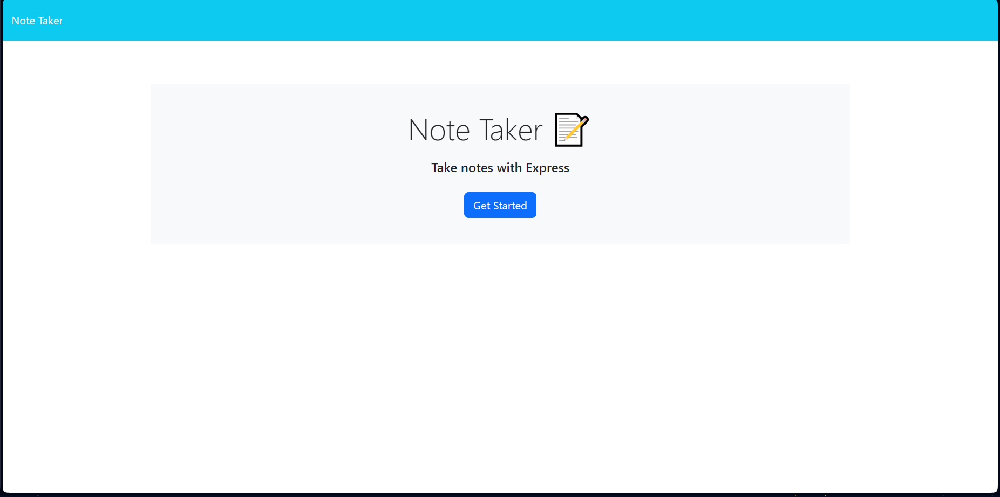
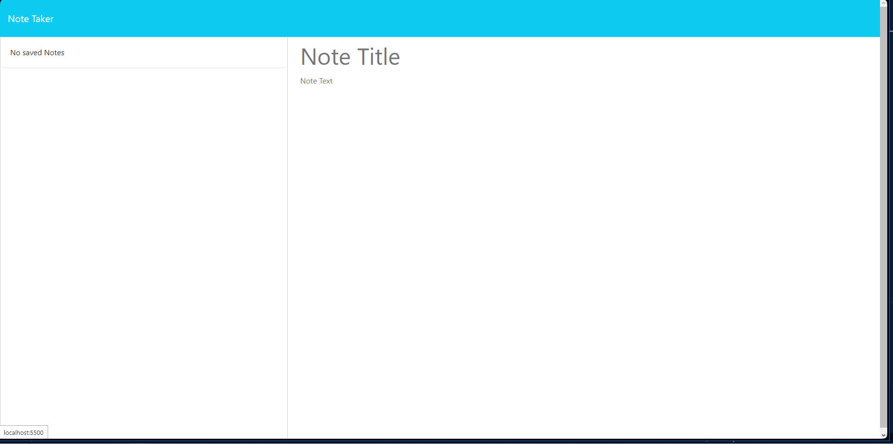
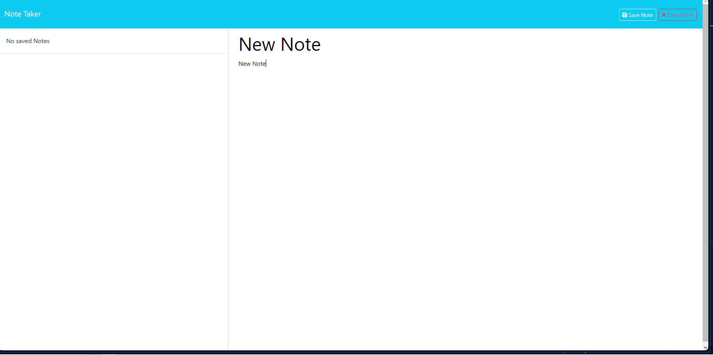

# Express.js Note Taker

## Table of Contents
*[Description](#description)
*[Images](#images)
*[User Story](#user-story)
*[Acceptance Criteria](#acceptance-criteria)
*[Installation](#installation)
*[API Routes](#api-routes)
*[Deployment](#deployment)
*[Bonus Features](#bonus-features)
*[Questions](#questions)
*[License](#license)

### Description
The Express.js Note Taker is a simple web application designed to help small business owners or anyone organize their thoughts and tasks by allowing them to create, save, and delete notes. The application features a user-friendly interface that makes it easy to jot down notes and keep track of your to-dos.

The application uses Express.js as its back end and stores notes in a JSON file, making it easy to manage and retrieve notes efficiently. With a clear and intuitive user interface, users can focus on their notes without distractions.

### Images

### User Story
As a small business owner, I want to be able to write and save notes so that I can organize my thoughts and keep track of tasks I need to complete.

### Acceptance Criteria
 1. When I open the Note Taker, I am presented with a landing page with a link to a notes page.

 2. When I click on the link to the notes page, I am presented with a page with existing notes listed in the left-hand column, plus empty fields to enter a new note title and the note's text in the right-hand column.

 3. When I enter a new note title and the note's text, a "Save Note" button and a "Clear Form" button appear in the navigation at the top of the page.

 4. When I click on the "Save Note" button, the new note I have entered is saved and appears in the left-hand column with the other existing notes, and the buttons in the navigation disappear.

 5. When I click on an existing note in the list in the left-hand column, that note appears in the right-hand column, and a "New Note" button appears in the navigation.

 6. When I click on the "New Note" button in the navigation, I am presented with empty fields to enter a new note title and the note's text in the right-hand column, and the button disappears.

### Installation
To get started with the Express.js Note Taker, follow these steps:

1. Clone the repository to your local machine:

2. Navigate to the project directory:

3. Install the required dependencies:

4. Start the application:

5. Open your web browser and go to http://localhost:3000 to use the Note Taker.

### API Routes
The application features the following API routes:

GET /api/notes: Reads the db.json file and returns all saved notes as JSON.

POST /api/notes: Receives a new note to save on the request body, adds it to the db.json file, and then returns the new note to the client. Each note is given a unique ID.

DELETE /api/notes/:id (Bonus Feature): Receives a query parameter that contains the ID of a note to delete. This route reads all notes from the db.json file, removes the note with the given id property, and rewrites the notes to the db.json file.

### Deployment
The Express.js Note Taker is deployed to Heroku and can be accessed online at https://ernests-express-note-taker-14c15f0fc829.herokuapp.com/notes. 

### Bonus Features
As a bonus, the Express.js Note Taker offers the ability to delete notes. This functionality is accessible on the front end. To use this feature, you can click the trash icon next to a note, and it will be removed from the list.

**API Route for Deleting Notes (Bonus Feature)**
DELETE /api/notes/:id: This route allows users to delete a note by providing the ID of the note to delete. The server will read all notes from the db.json file, remove the note with the given id property, and then rewrite the notes to the db.json file.

### Questions
Thank you for using the Express.js Note Taker! If you have any questions or need further assistance, please don't hesitate to reach out.

The Application is deployed to Hiroku at
https://ernests-express-note-taker-14c15f0fc829.herokuapp.com/notes

The Repository is available at
https://github.com/kiedae/noteTaker

### License
This project is licensed under the MIT License.